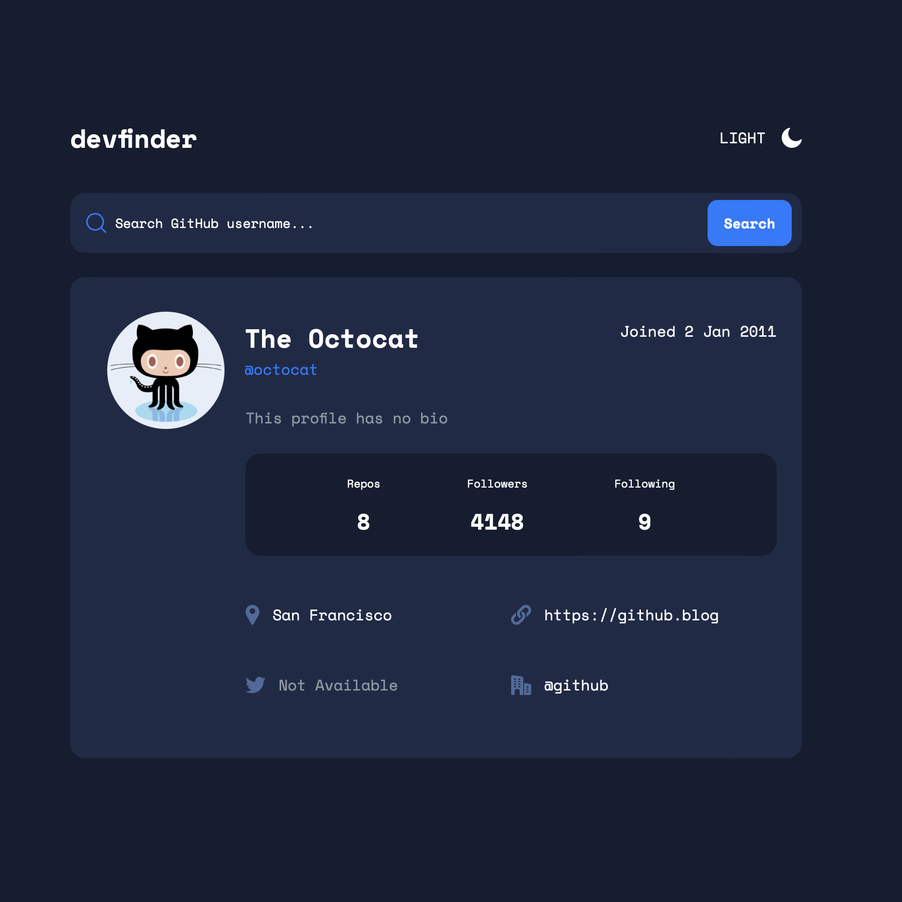

# Frontend Mentor - GitHub user search app solution

## Table of contents

- [Overview](#overview)
  - [The challenge](#the-challenge)
  - [Screenshot](#screenshot)
  - [Links](#links)
- [My process](#my-process)
  - [Built with](#built-with)
  - [What I learned](#what-i-learned)
  - [Continued development](#continued-development)
  - [Useful resources](#useful-resources)
- [Author](#author)
- [Acknowledgments](#acknowledgments)

## Overview

### The challenge

Users should be able to:

- View the optimal layout for the app depending on their device's screen size
- See hover states for all interactive elements on the page
- Search for GitHub users by their username
- See relevant user information based on their search
- Switch between light and dark themes

### Screenshot



## My process
I wanted to practice working with non-static applications seeing that I have a decent understanding of making layouts using html, css, javascript and sass/scss.
I started with adding all of the packages I knew I wanted to implement such as sass and Reactjs using npm. After I got workspace in order I started with adding all of the known starter styles, this included the colors, the font, and the device breakpoints for future use.
I then started to make the components after thinking about how to break the application into reusable react components. Since I am not a react expert I read the react documentation just so I can understand the basic concepts. I started in a weird order I'd say by making the header first, then the "card" component and finally the input. The input was added last because I knew the most important aspect of the input was the functionality, and thus would take longer.
Once I was able to get all of the components created and rendered I began to style them all until the application was responsive, and to the specs provided that I was able to track using Figma. Then I was able to incorporate the github api into the application using a fetch request. I spent a majority of the time making sure that the states were being used appropriately, at first I implemented useStates but this caused more problems then solutions. I was able to use resources like stackoverflow and developer blogs to cater to this application. One issue I had was not catching the returned error leading to me making too many request in an hour, which slowed my progress a little. After user testing my application was ready for it's development build.

### Built with

- Semantic HTML5 markup
- CSS custom properties
- Flexbox
- CSS Grid
- Mobile-first workflow
- [Sass/Scss](https://sass-lang.com) - CSS Extension
- [React](https://reactjs.org/) - JS library

### What I learned
I was able to learn a lot and so I do not bore you I will list a few of them below ⬇️
-Catching api errors
-React states
-Theming
-React mounting
-Using documentation to learn languages/frameworks
-More efficient "googling" methods

A few bits of code I am proud of are:

```scss
@mixin breakpoint($respond) {
    @if $respond == "mobile" {@media (max-width: 767px) {@content}};

    @if $respond == "tablet" {@media (min-width: 768px) {@content}};

    @if $respond == "tabletLandscape" {@media (min-width: 925px) {@content}};

    @if $respond == "desktop" {@media (min-width: 1024px) {@content}};
}
```
```js
  updateUserAccount(){
    var prevAccount = this.state.userAccount;
    fetch('http://api.github.com/users/' + this.state.username)
      .then(result => result.json())
      .then(body => {
        if(body.message === "Not Found") {
          this.setUserAccount(prevAccount);
          this.setState({
            resultFound: false
          })
        } else {
          this.setUserAccount(body)
          this.setState({
            resultFound: true
          })
        }
      });
  }
```

### Continued development
I plan on practicing the concepts learned working on other projects, then I would like to make updates to this application. I find that going back and updating older projects solidifies my understanding of concepts. I do think working with frameworks could help to reduce some of the replication thus making the application work more efficiently.


### Useful resources

- [React Docs](https://reactjs.org/docs/getting-started.html) - This helped me to better understand the logic of working with react. I did like reading what the docs said regarding what works and what doesn't specifically regarding states and props.
- [Dev.to Getting Previous State](https://dev.to/bhuwanadhikari/react-hooks-get-prevstate-values-4555) - This is an informational article which helped me better understand getting the value of the previous state. I'd recommend it to anyone still learning this concept, even if it does not directly apply to your current problem.

## Author

- Github - [Not Kijana](https://github.com/NotKijana)
- Frontend Mentor - [@NotKijana](https://www.frontendmentor.io/profile/NotKijana)

## Acknowledgments

Thank you to all of the developer blogs that helped me along the way. Thank you FrontendMentor for the application challenge.